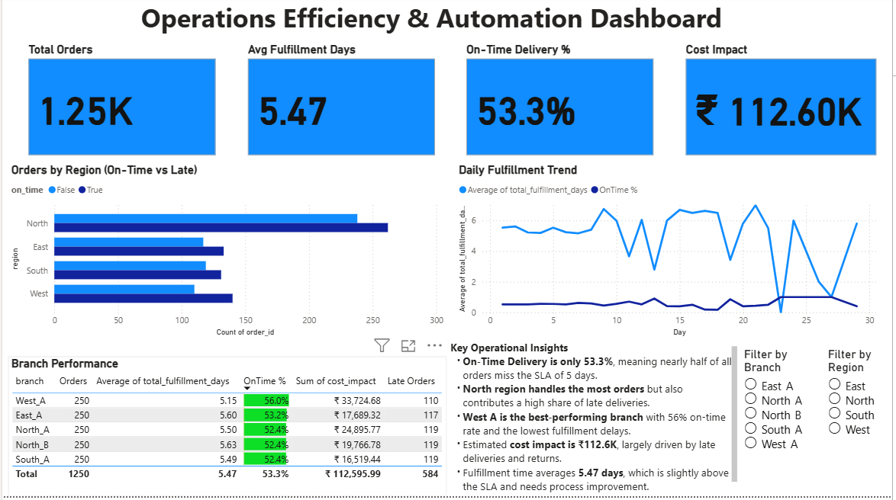

# 🧭 Operations Efficiency & Automation Dashboard  
### Python ETL + Power BI • End-to-End Analytics Project

---

## 🚀 TL;DR — What This Project Delivers  
A complete operations analytics workflow that:

- Automates ingestion & cleaning of **daily branch order files** using **Python ETL**  
- Produces a unified, analysis-ready dataset  
- Reveals operational bottlenecks through **Power BI dashboards**  
- Quantifies **on-time delivery performance**, **delay patterns**, and **cost impact**  
- Demonstrates **business-focused analytics + automation** — ideal for Operations, Business Analyst, and Data Analyst roles



---

## 📌 Why This Project Matters  
Operations teams lose money from:

- Manual merging of branch files  
- Inconsistent data formats  
- Delayed deliveries  
- High return rates  
- Lack of visibility into branch/region performance  

This project solves those problems by building a **repeatable data pipeline** + **executive dashboard** showing:

- Which branches/regions cause delays  
- How much money late deliveries cost  
- Trends in fulfillment time  
- Data-driven recommendations for fixing bottlenecks  

---

## ✨ Highlights (What Makes This Project Stand Out)

### ⚙️ **Automated ETL Pipeline**
- Merges multi-branch CSVs  
- Cleans/normalizes schema  
- Engineers key metrics:  
  - `processing_time_days`  
  - `delivery_time_days`  
  - `total_fulfillment_days`  
  - `on_time` (SLA-based)  
  - `cost_impact`  

### 📊 **Power BI Dashboard**
- KPI summary (On-Time %, Avg Fulfillment Days, Cost Impact)  
- Region-wise performance  
- Daily efficiency trends  
- Branch performance table  
- Drilldown page for order-level analysis  

### 💰 **Business Impact Identified**
- ₹112.6K potential cost impact due to delays & returns (sample data)  
- North region identified as high-delay zone  
- West A branch marked as top performer  
- Delivery times just above SLA → opportunity for optimization  

### ⚡ **Super Reproducible**
Just run the ETL script — everything rebuilds automatically.

---

## 🛠️ Quick Start (Run Locally in 5 Minutes)

### **1️⃣ Clone the repository**
```bash
git clone https://github.com/ishwara24/ops-efficiency-automation-dashboard
cd ops-dashboard-project
2️⃣ (Optional) Create a virtual environment
python -m venv venv
# Windows
venv\Scripts\activate.bat
# macOS/Linux
# source venv/bin/activate

3️⃣ Install dependencies
pip install -r requirements.txt

4️⃣ Generate sample branch files (optional)
python code/generate_sample_branch_files.py

5️⃣ Run the ETL pipeline
python code\etl_pipeline.py

6️⃣ Open the Power BI Dashboard

Open:

PowerBI/Operations_Dashboard.pbix


(or the exported PDF/PNG)


